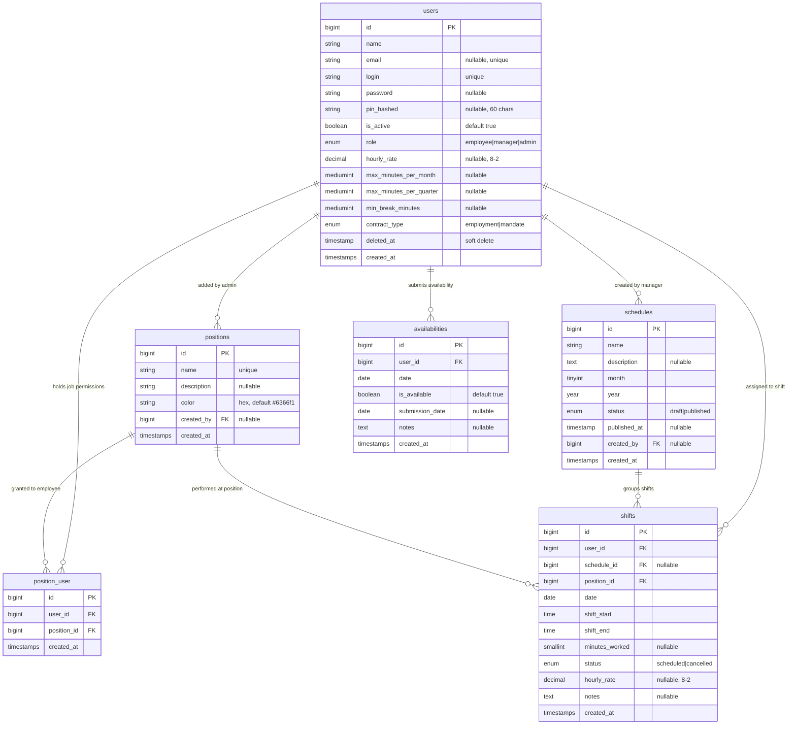

# SHIFTFlow

[](https://php.net)
[](https://laravel.com)
[](#running-tests)
[](https://phpstan.org)

REST API for managing employee shift schedules at Wieliczka Salt Mine. · [Try it live ↓](#testing-the-api)

---

## Live Deployment

| Service                | URL                                                             |
| ----------------------- | ---------------------------------------------------------------- |
| Backend API (Hetzner)   | [shiftflow-api.duckdns.org](https://shiftflow-api.duckdns.org)   |
| Frontend (React SPA)    | [shiftflow.duckdns.org](https://shiftflow.duckdns.org) — 🚧 in progress, nothing deployed yet |

---

## About the Project

Wieliczka Salt Mine handles tourist traffic through a team of employees working across 27 specialised positions — ticket booths, parking wardens, tram operators, guides, and more. Every month, a manager is responsible for building a schedule that covers all positions while respecting each employee's availability, contract limits, and required rest periods.

Until now, that work was done entirely in Excel — manually, one shift at a time, with no validation and no single source of truth. SHIFTFlow was built to replace that workflow.

The system gives managers a structured way to create and publish monthly schedules, import employees from a CSV export of their existing spreadsheet, and enforce business rules automatically — shift conflicts, position permissions, hour limits, and minimum breaks are all validated on the server before a shift is saved. Employees can log in to view their own shifts from published schedules and declare their availability for upcoming months.

The current version is a fully tested REST API. A React SPA frontend is in progress at [shiftflow.duckdns.org](https://shiftflow.duckdns.org) (nothing deployed there yet), which will let managers build schedules visually in the browser rather than through API calls.

---

## Tech Stack

- **PHP** 8.2
- **Laravel** 12
- **MySQL** 8.0
- **Redis** 7 — JWT blacklist, cache
- **Docker** + Docker Compose
- **JWT Auth** — `tymon/jwt-auth`
- **Testing** — PestPHP (feature tests against real MySQL, no SQLite)
- **Static analysis** — PHPStan / Larastan, level 6, no baseline

---

## Roles

| Role       | Permissions                                                                      |
| ---------- | -------------------------------------------------------------------------------- |
| `admin`    | Full access — manages employees, positions, schedules, and availabilities        |
| `manager`  | Creates and publishes schedules, adds shifts, reads positions and availabilities |
| `employee` | Reads published schedules and news posts, manages own availability              |

---

## Architecture

### Request lifecycle

```
Route (routes/api.php)
  → Middleware (auth:api, role:admin,manager,...)
  → FormRequest (input validation)
  → Controller (thin — delegates to services)
  → Service Layer (business logic)
  → Repository (DB writes) / Model (DB reads)
  → Resource (JSON serialization)
```

### Design patterns

**Chain of Responsibility — shift validation**
`ValidationService` runs 7 validators in order, stopping on the first failure:

```
PositionPermission → Availability → PositionUniqueness → TimeConflict
  → MinimumBreak → MaxHoursPerMonth → MaxHoursPerQuarter
```

Each validator implements `ShiftValidatorInterface`. The execution order is defined in `AppServiceProvider`, not hardcoded in the service — adding or reordering a validator requires no changes to `ValidationService` itself (Dependency Inversion).

**Pipeline — CSV import**
`EmployeesCsvExtractor → EmployeeCsvValidator → EmployeeDataAssembler → EmployeeRepository`

Each stage has a single responsibility and operates on typed DTOs (`EmployeeImportData`). The separator is auto-detected; column `B` maps to positions B1–B8, `WR` maps to WR/WR2/WR3, etc.

**Value Objects — batch shift creation**
`BatchResult` is a readonly DTO returned from `ScheduleService::addShiftsBatch()`. `ShiftValidationData` carries validated shift data through the validator chain without mutation.

### Mine positions

The mine operates 27 positions across functional groups: dispatchers (`PD`), ticketing booths (`B1`–`B8`), parking wardens (`PW`, `PW2`), route wardens (`WR`, `WR2`, `WR3`), security (`WS`, `WS2`), stockrooms (`SR`), tram operators (`TGT`, `TG`), guides (`PTG`, `PTG2`, `OTG`, `OTG2`), ticket booths (`K1`, `K2`), information booth (`BT`), and employee leave placeholder (`U`). Each position stores a hex color used for schedule visualization.

---

## Project Structure

```
SHIFTFlow/
├── backend/                        # Laravel application
│   ├── app/
│   │   ├── Http/
│   │   │   ├── Controllers/Api/    # Thin controllers — delegate to services
│   │   │   ├── Middleware/         # RoleMiddleware, CheckJwtBlacklist
│   │   │   ├── Requests/           # FormRequests — validation layer
│   │   │   └── Resources/          # JSON serialization
│   │   ├── Services/
│   │   │   ├── Batch/              # BatchPreprocessor, BatchValidationService
│   │   │   ├── Import/             # CSV pipeline (Extract → Validate → Assemble → Persist)
│   │   │   └── Validation/         # ValidationService + 7 shift validators
│   │   ├── Repositories/           # EmployeeRepository (CSV import writes)
│   │   └── DTOs/                   # ShiftValidationData, BatchResult
│   ├── database/
│   │   ├── migrations/
│   │   └── seeders/                # Demo data — 7 accounts, 27 positions, 2 schedules
│   └── tests/
│       ├── Feature/                # API endpoint tests (real MySQL)
│       └── Unit/                   # Validator and helper unit tests
├── docker/                         # MySQL init scripts
├── docs/                           # Postman collection, CSV import template
└── docker-compose.yml
```

---

## Database Schema



---

## Getting Started

**Prerequisites:** Docker and Docker Compose installed.

**1. Clone and configure**

```bash
git clone <repository-url>
cd SHIFTFlow
cp .env.example .env
cp backend/.env.example backend/.env
```

Open `.env` and set `DB_PASSWORD` and `DB_ROOT_PASSWORD` to any values.
Open `backend/.env` and change `APP_ENV=production` to `APP_ENV=local` and `APP_DEBUG=false` to `APP_DEBUG=true`.

**2. Start containers**

```bash
docker compose up -d
```

API available at `http://localhost:8000`.

**3. Initialize the application**

```bash
docker compose exec app php artisan key:generate
docker compose exec app php artisan jwt:secret
docker compose exec app php artisan migrate:fresh --seed
```

**4. Verify the setup**

```bash
curl -X POST http://localhost:8000/api/auth/login \
  -H "Content-Type: application/json" \
  -d '{"login":"admin","password":"password"}'
```

A successful response returns `{"user": {...}}` and sets a `jwt_token` httpOnly cookie. Postman stores the cookie automatically — no manual token handling needed.

---

## Demo Accounts

Seeded by `php artisan migrate:fresh --seed`. Includes one published schedule (April 2026, 26 shifts) and one draft schedule (May 2026).

| Login     | Password / PIN | Role     |
| --------- | -------------- | -------- |
| `admin`   | `password`     | admin    |
| `akowal`  | `password`     | manager  |
| `tnowak`  | PIN `1234`     | employee |
| `jwisn`   | PIN `1111`     | employee |
| `knowak`  | PIN `2222`     | employee |
| `pzajac`  | PIN `3333`     | employee |
| `adabrow` | PIN `4444`     | employee |

Admins and managers log in via `POST /api/auth/login` with `login` + `password`.
Employees log in via `POST /api/auth/login-pin` with `login` + `pin`.

---

## Environment Variables

Root `.env` (Docker Compose level):

| Variable           | Description                                     |
| ------------------ | ----------------------------------------------- |
| `DB_PASSWORD`      | MySQL user password — must match `backend/.env` |
| `DB_ROOT_PASSWORD` | MySQL root password                             |

`backend/.env` (Laravel application):

| Variable               | Description                                                |
| ---------------------- | ---------------------------------------------------------- |
| `APP_ENV`              | `local` for development, `production` for deployment       |
| `APP_DEBUG`            | `true` locally, `false` in production                      |
| `APP_KEY`              | Generated by `php artisan key:generate`                    |
| `JWT_SECRET`           | Generated by `php artisan jwt:secret`                      |
| `DB_HOST`              | `db` inside Docker (service name)                          |
| `DB_DATABASE`          | Application database name                                  |
| `DB_USERNAME`          | MySQL user                                                 |
| `DB_PASSWORD`          | Must match root `.env`                                     |
| `REDIS_HOST`           | `redis` inside Docker                                      |
| `FRONTEND_URL`         | Allowed CORS origin — `http://localhost:5173` for local dev (not needed in production where frontend and backend share the same domain) |
| `DEFAULT_EMPLOYEE_PIN` | PIN assigned to all CSV-imported accounts (default `1234`) |

---

## Testing the API

> **Note:** This project is a REST API only — there is no frontend. All interaction is through HTTP requests (Postman, curl, etc.).

### Postman collections

| Collection                                                                                 | Base URL                             |
| ------------------------------------------------------------------------------------------ | ------------------------------------ |
| [`docs/SHIFTFLOW_API.postman_collection.json`](docs/SHIFTFLOW_API.postman_collection.json) | `http://localhost:8000` (local)      |
| [`docs/LIVEPREVIEW.postman_collection.json`](docs/LIVEPREVIEW.postman_collection.json)     | `https://shiftflow-api.duckdns.org` (live) |

## Demo credentials: `admin` / `password` — see [Demo Accounts](#demo-accounts) for the full list.

## API Reference

All authenticated endpoints require the `jwt_token` httpOnly cookie (set automatically on login). No manual token handling needed.
Base URL: `http://localhost:8000/api`

---

### Authentication

| Method | Path              | Auth   | Description                        |
| ------ | ----------------- | ------ | ---------------------------------- |
| POST   | `/auth/login`     | —      | JWT login for admin/manager        |
| POST   | `/auth/login-pin` | —      | PIN login for employee             |
| POST   | `/auth/logout`    | Cookie | Invalidate token (Redis blacklist) |

---

#### `POST /auth/login`

**Request:**

| Field      | Type   | Required | Notes       |
| ---------- | ------ | -------- | ----------- |
| `login`    | string | ✓        | —           |
| `password` | string | ✓        | min 6 chars |

Sets `jwt_token` httpOnly cookie (SameSite=Lax, Secure in production). Cookie is handled automatically by Postman and browsers.

**Response 200:**

```json
{
	"user": { "id": 1, "login": "admin", "name": "Admin User", "role": "admin", "locale": "pl", "is_active": true }
}
```

**Errors:** `401` Wrong credentials | `403` Account inactive | `422` Validation failed

---

#### `POST /auth/login-pin`

**Request:**

| Field   | Type    | Required | Notes            |
| ------- | ------- | -------- | ---------------- |
| `login` | string  | ✓        | —                |
| `pin`   | numeric | ✓        | exactly 4 digits |

Sets `jwt_token` httpOnly cookie. **Response 200:** same shape as `/auth/login`

**Errors:** `401` Wrong credentials | `403` Account inactive | `422` Validation failed

---

#### `POST /auth/logout`

**Response 200:** `{ "message": "Logged out successfully" }`

The `jti` claim is stored in Redis with TTL equal to the token's remaining lifetime. Re-using the token after logout returns `401`.

**Errors:** `401` No token provided

---

### Me

**Auth:** All authenticated users (role restrictions per endpoint).

| Method | Path               | Auth             | Description                      |
| ------ | ------------------ | ---------------- | -------------------------------- |
| GET    | `/me`              | All              | Return current user data         |
| PATCH  | `/me/password`     | Admin, Manager   | Change password                  |
| PATCH  | `/me/pin`          | Employee only    | Change PIN                       |
| PATCH  | `/me/locale`       | All              | Change language preference       |

---

#### `GET /me`

**Response 200:**

```json
{
	"data": {
		"id": 3,
		"name": "Tomasz Nowak",
		"email": "tnowak@example.com",
		"login": "tnowak",
		"role": "employee",
		"locale": "pl",
		"is_active": true,
		"hourly_rate": 25,
		"monthly_hour_limit": 160,
		"quarter_hour_limit": 480,
		"break_limit": 11,
		"contract_type": "employment_contract",
		"positions": [
			{
				"id": 2,
				"name": "B1",
				"description": "Ticketing Officer 1",
				"color": "#FFF200"
			}
		],
		"created_at": "2026-05-02T16:07:47+00:00"
	}
}
```

`monthly_hour_limit`, `quarter_hour_limit`, `break_limit` are returned in hours (converted from minutes stored in DB).

---

#### `PATCH /me/password`

**Auth:** Admin and Manager only.

**Request:**

| Field                       | Type   | Required | Notes                          |
| --------------------------- | ------ | -------- | ------------------------------ |
| `current_password`          | string | ✓        | must match current password    |
| `new_password`              | string | ✓        | min 8 chars, confirmed         |
| `new_password_confirmation` | string | ✓        | must match `new_password`      |

**Response 200:** `{ "message": "Password changed successfully." }`

**Errors:** `422` Validation failed (wrong current password, mismatch)

---

#### `PATCH /me/pin`

**Auth:** Employee only.

If the employee has no PIN set yet, `current_pin` is not required (first-time setup).

**Request:**

| Field                  | Type    | Required      | Notes            |
| ---------------------- | ------- | ------------- | ---------------- |
| `current_pin`          | numeric | if PIN is set | exactly 4 digits |
| `new_pin`              | numeric | ✓             | exactly 4 digits |
| `new_pin_confirmation` | numeric | ✓             | must match `new_pin` |

**Response 200:** `{ "message": "PIN changed successfully." }`

**Errors:** `403` if role is not employee | `422` Wrong current PIN or mismatch

---

#### `PATCH /me/locale`

**Request:**

| Field    | Type   | Required | Notes          |
| -------- | ------ | -------- | -------------- |
| `locale` | string | ✓        | `pl` or `en`   |

**Response 200:** `{ "message": "Locale changed successfully." }`

---

### News

**Auth:** All authenticated users can read. Admin only for write.

| Method | Path           | Description                        |
| ------ | -------------- | ---------------------------------- |
| GET    | `/news`        | List news posts (paginated)        |
| GET    | `/news/{id}`   | Get single news post               |
| POST   | `/news`        | Create news post (admin only)      |
| PATCH  | `/news/{id}`   | Update news post (admin only)      |
| DELETE | `/news/{id}`   | Delete news post (admin only)      |

---

#### `GET /news`

**Query parameters:**

| Param    | Type   | Notes                      |
| -------- | ------ | -------------------------- |
| `search` | string | search by title or content |

**Response 200:** Paginated (20/page). Each item:

```json
{
	"id": 1,
	"title": "Zmiana grafiku lipiec",
	"content": "Treść ogłoszenia...",
	"is_important": false,
	"author": {
		"id": 1,
		"name": "Admin User"
	},
	"created_at": "2026-06-01T10:00:00+00:00",
	"updated_at": "2026-06-01T10:00:00+00:00"
}
```

---

#### `POST /news`

**Request:**

| Field          | Type    | Required | Notes           |
| -------------- | ------- | -------- | --------------- |
| `title`        | string  | ✓        | max 255         |
| `content`      | string  | ✓        | min 10 chars    |
| `is_important` | boolean | —        | default `false` |

`author_id` is set automatically to the authenticated user.

**Response 201:** News post object + `message: "News post created successfully"`.

---

#### `PATCH /news/{id}`

Same fields as create, all optional.

**Response 200:** Updated news post + `message: "News post updated successfully"`.

---

#### `DELETE /news/{id}`

**Response 200:** `{ "message": "News post deleted successfully" }`

---

### Schedules

**Read:** All roles — employees see published schedules only. **Write:** Admin or Manager.

| Method | Path                           | Description                                           |
| ------ | ------------------------------ | ----------------------------------------------------- |
| GET    | `/schedules`                   | List schedules — employees see published only         |
| POST   | `/schedules`                   | Create schedule                                       |
| GET    | `/schedules/{id}`              | Get schedule — employees get 403 on drafts            |
| PATCH  | `/schedules/{id}`              | Update name / description                             |
| DELETE | `/schedules/{id}`              | Delete schedule (cascades to shifts)                  |
| POST   | `/schedules/{id}/shifts/batch` | Add shifts in bulk                                    |
| POST   | `/schedules/{id}/publish`      | Publish draft schedule                                |

---

#### `GET /schedules`

**Query parameters:**

| Param      | Type    | Notes               |
| ---------- | ------- | ------------------- |
| `month`    | integer | 1–12                |
| `year`     | integer | —                   |
| `search`   | string  | search by name      |
| `per_page` | integer | default 20, max 150 |

**Response 200:** Paginated. Each item:

```json
{
	"id": 1,
	"name": "April 2026 Schedule",
	"description": "Schedule for April 2026",
	"month": 4,
	"year": 2026,
	"status": "published",
	"published_at": "2026-05-02T16:07:48+00:00",
	"created_by": "Admin User",
	"total_shifts": 26,
	"created_at": "2026-05-02T16:07:48+00:00"
}
```

`status`: `draft` | `published`. `published_at` is `null` when draft.

---

#### `POST /schedules`

**Request:**

| Field         | Type    | Required | Notes                     |
| ------------- | ------- | -------- | ------------------------- |
| `name`        | string  | ✓        | max 255                   |
| `month`       | integer | ✓        | 1–12, unique per year     |
| `year`        | integer | ✓        | current year to current+5 |
| `description` | string  | —        | —                         |

**Response 201:**

```json
{
	"data": {
		"id": 4,
		"name": "June 2026 Schedule",
		"month": 6,
		"year": 2026,
		"status": "draft",
		"published_at": null,
		"total_shifts": 0,
		"created_by": "Admin User",
		"created_at": "...",
		"updated_at": "..."
	},
	"message": "Schedule created successfully"
}
```

---

#### `GET /schedules/{id}`

Full schedule including `shifts` array and `updated_at`.

**Response 200:**

```json
{
	"data": {
		"id": 4,
		"name": "June 2026 Schedule",
		"month": 6,
		"year": 2026,
		"status": "draft",
		"shifts": [],
		"total_shifts": 0,
		"created_at": "...",
		"updated_at": "..."
	}
}
```

---

#### `PATCH /schedules/{id}`

Updates `name` and/or `description` only. Month and year are immutable after creation.

**Response 200:** Schedule object (without `shifts` array) + `message`.

---

#### `DELETE /schedules/{id}`

Cascade-deletes all associated shifts.

**Response 200:** `{ "message": "Schedule deleted successfully" }`

---

#### `POST /schedules/{id}/shifts/batch`

Add multiple shifts in a single atomic transaction. If any shift fails validation, none are saved.

**Request:**

```json
{
	"shifts": [
		{
			"client_temp_id": "row_1",
			"user_id": 3,
			"position_id": 2,
			"date": "2026-05-10",
			"shift_start": "07:00",
			"shift_end": "15:00",
			"notes": "Morning shift"
		}
	]
}
```

**Per-shift fields:**

| Field            | Type    | Required | Notes                                                  |
| ---------------- | ------- | -------- | ------------------------------------------------------ |
| `client_temp_id` | string  | ✓        | distinct within batch — used to key errors in response |
| `user_id`        | integer | ✓        | must exist                                             |
| `position_id`    | integer | ✓        | must exist                                             |
| `date`           | string  | ✓        | Y-m-d, must match schedule month/year                  |
| `shift_start`    | string  | ✓        | H:i                                                    |
| `shift_end`      | string  | ✓        | H:i                                                    |
| `notes`          | string  | —        | max 500                                                |
| `status`         | string  | —        | `scheduled` \| `cancelled`                             |

**Business rules checked per shift:** user assigned to position, user active, no time overlap on same date, minimum break between shifts, monthly hour limit, quarterly hour limit.

**Response 201:**

```json
{
	"message": "Batch created successfully",
	"count": 1,
	"shifts": [
		{
			"id": 27,
			"schedule_id": 2,
			"user_id": 3,
			"user_name": "Tomasz Nowak",
			"position_id": 2,
			"position_name": "B1",
			"date": "2026-05-10",
			"shift_start": "07:00",
			"shift_end": "15:00",
			"minutes_worked": 480,
			"hours_worked": 8,
			"status": "scheduled",
			"notes": "Morning shift",
			"created_at": "...",
			"updated_at": "..."
		}
	]
}
```

**Error 422 — business validation failed:**

```json
{
	"message": "Batch validation failed",
	"errors": {
		"row_1": {
			"conflict": ["User has no permission for the selected position"]
		}
	}
}
```

Errors are keyed by `client_temp_id`.

---

#### `POST /schedules/{id}/publish`

**Response 200:** Full schedule with `status: "published"` and `published_at` set to current timestamp.

**Error 409:** `{ "message": "Schedule is already published" }`

---

### Shifts

**Auth:** Admin/Manager for write. Employees can read their own shifts from published schedules only.

| Method | Path           | Description                         |
| ------ | -------------- | ----------------------------------- |
| GET    | `/shifts`      | List shifts (paginated)             |
| GET    | `/shifts/{id}` | Get single shift                    |
| PATCH  | `/shifts/{id}` | Update shift                        |
| DELETE | `/shifts/{id}` | Delete shift                        |
| POST   | `/shifts`      | **Deprecated** — use batch endpoint |

---

#### `GET /shifts`

**Query parameters:**

| Param      | Type    | Notes               |
| ---------- | ------- | ------------------- |
| `user_id`  | integer | filter by user      |
| `date`     | string  | Y-m-d, exact date   |
| `from`     | string  | Y-m-d, range start  |
| `to`       | string  | Y-m-d, range end    |
| `per_page` | integer | default 50, max 150 |

**Response 200:** Paginated list. Each shift:

```json
{
	"id": 1,
	"schedule_id": 1,
	"user_id": 3,
	"user_name": "Tomasz Nowak",
	"position_id": 2,
	"position_name": "B1",
	"date": "2026-04-07",
	"shift_start": "07:00",
	"shift_end": "15:00",
	"minutes_worked": 480,
	"hours_worked": 8,
	"status": "scheduled",
	"notes": null,
	"created_at": "...",
	"updated_at": "..."
}
```

---

#### `PATCH /shifts/{id}`

**Request:**

| Field         | Type    | Required | Notes                      |
| ------------- | ------- | -------- | -------------------------- |
| `user_id`     | integer | ✓        | —                          |
| `position_id` | integer | ✓        | —                          |
| `date`        | string  | ✓        | Y-m-d                      |
| `shift_start` | string  | ✓        | H:i                        |
| `shift_end`   | string  | ✓        | H:i                        |
| `schedule_id` | integer | —        | —                          |
| `status`      | string  | —        | `scheduled` \| `cancelled` |
| `notes`       | string  | —        | max 500                    |

**Response 200:** Updated shift + `message`.

---

#### `DELETE /shifts/{id}`

**Response 200:** `{ "message": "Shift deleted successfully" }`

---

#### `POST /shifts` (Deprecated)

**Response 410:** `{ "message": "Use POST /api/schedules/{id}/shifts/batch instead" }`

---

### Positions

**Auth:** Admin/Manager for read. Admin only for write.

| Method | Path                     | Description                         |
| ------ | ------------------------ | ----------------------------------- |
| GET    | `/positions`             | List positions (paginated, 20/page) |
| GET    | `/positions/{id}`        | Get single position                 |
| GET    | `/positions/{id}/shifts` | List shifts for a position          |
| POST   | `/positions`             | Create position                     |
| PATCH  | `/positions/{id}`        | Update position                     |
| DELETE | `/positions/{id}`        | Delete position                     |

**System vs user-created positions:** Positions seeded with no creator return only `id`, `name`, `description`, `color`. Positions created via the API additionally include `creator_name` and `created_at`.

---

#### `GET /positions`

**Response 200:** Paginated (20/page):

```json
{
	"id": 1,
	"name": "PD",
	"description": "Dispatcher Assistant",
	"color": "#F7C58A"
}
```

---

#### `POST /positions`

**Request:**

| Field         | Type   | Required | Notes               |
| ------------- | ------ | -------- | ------------------- |
| `name`        | string | ✓        | unique, max 4 chars |
| `description` | string | —        | max 255             |
| `color`       | string | —        | hex `#RRGGBB`       |

**Response 201:**

```json
{
	"data": {
		"id": 28,
		"name": "B9",
		"description": "New cashier position",
		"color": "#FFF200",
		"creator_name": "Admin User",
		"created_at": "..."
	},
	"message": "Position created successfully"
}
```

---

#### `DELETE /positions/{id}`

**Response 200:** `{ "message": "Position deleted successfully" }`

**Error 409:** `{ "message": "Cannot delete position with linked shifts." }`

---

### Employees

**Auth:** Admin only. Returns only `role: employee` — admins and managers are excluded.

| Method | Path                | Description                           |
| ------ | ------------------- | ------------------------------------- |
| GET    | `/employees`        | List employees (paginated)            |
| GET    | `/employees/{id}`   | Get employee                          |
| POST   | `/employees`        | Create employee                       |
| PATCH  | `/employees/{id}`   | Update employee                       |
| DELETE | `/employees/{id}`   | Soft delete (preserves shift history) |
| POST   | `/employees/import` | Bulk import from CSV                  |

---

#### `GET /employees`

**Query parameters:** `search` (name), `per_page` (default 50, max 150)

**Response 200:** Paginated. Each employee:

```json
{
	"id": 3,
	"name": "Tomasz Nowak",
	"email": "tnowak@example.com",
	"login": "tnowak",
	"role": "employee",
	"is_active": true,
	"hourly_rate": 25,
	"monthly_hour_limit": 160,
	"quarter_hour_limit": 480,
	"break_limit": 11,
	"contract_type": "employment_contract",
	"positions": [
		{
			"id": 2,
			"name": "B1",
			"description": "Ticketing Officer 1",
			"color": "#FFF200"
		}
	],
	"created_at": "..."
}
```

---

#### `POST /employees`

**Request:**

| Field                     | Type    | Required | Notes                                       |
| ------------------------- | ------- | -------- | ------------------------------------------- |
| `name`                    | string  | ✓        | max 255                                     |
| `pin`                     | numeric | ✓        | exactly 4 digits                            |
| `positions`               | array   | ✓        | min 1 position ID                           |
| `hourly_rate`             | numeric | —        | min 0                                       |
| `contract_type`           | string  | —        | `employment_contract` \| `mandate_contract` |
| `max_minutes_per_month`   | integer | —        | min 0                                       |
| `max_minutes_per_quarter` | integer | —        | min 0                                       |
| `min_break_minutes`       | integer | —        | min 0                                       |

New employees start as `is_active: false`. Login is auto-generated from name (`LoginGeneratorService`). Email is not required.

**Response 201:** Full employee object + `message`.

---

#### `PATCH /employees/{id}`

Same fields as create, all optional. `positions` is fully replaced (sync), not merged. `login` is immutable after creation.

**Response 200:** Updated employee + `message`.

---

#### `DELETE /employees/{id}`

Soft delete — historical shift records are preserved.

**Response 200:** `{ "message": "Employee deleted successfully" }`

---

#### `POST /employees/import`

**Content-Type:** `multipart/form-data` | **Form field:** `csv` (file, max 500 rows)

See `docs/employees_import_template.csv` for the format.

**CSV format:**

- Separator: auto-detected (`,` `;` `\t` `|` `:`)
- Column 0: row number (ignored)
- Column 1: employee name — exactly two words (`Jan Kowalski`)
- Column 2: contract type — keyword detection: `UOP` / `EMPLOY` / `ETAT` → `employment_contract`; `ZLEC` / `MANDATE` → `mandate_contract`
- Columns 3+: position headers — value `TAK` = assigned

| CSV column                    | Maps to DB positions           |
| ----------------------------- | ------------------------------ |
| `B`                           | B1, B2, B3, B4, B5, B6, B7, B8 |
| `WR`                          | WR, WR2, WR3                   |
| `WS`                          | WS, WS2                        |
| `PW`                          | PW, PW2                        |
| `K`                           | K1, K2                         |
| `OTG`                         | OTG, OTG2                      |
| `PTG`                         | PTG, PTG2                      |
| `PD`, `SR`, `TG`, `TGT`, `BT` | one-to-one                     |

**Response 200:**

```json
{
	"success": true,
	"created": 98,
	"updated": 2,
	"total": 100,
	"validation_issues": []
}
```

Existing employees matched by name are updated, not duplicated. All imported accounts receive the default PIN from `DEFAULT_EMPLOYEE_PIN` env (default `1234`).

**Error 422:** `validation_issues` is populated per-row when names are invalid or contract type is missing.

---

### Availabilities

**Auth:** All authenticated users. Employees see only their own records.

| Method | Path                   | Description                              |
| ------ | ---------------------- | ---------------------------------------- |
| GET    | `/availabilities`      | List (paginated, 20/page)                |
| POST   | `/availabilities`      | Create or update (upsert by user + date) |
| DELETE | `/availabilities/{id}` | Delete                                   |

---

#### `GET /availabilities`

**Query parameter:** `user_id` (admin/manager only — employees are scoped automatically)

**Response 200:** Paginated list.

---

#### `POST /availabilities`

Same user + date = update (returns 200). New record = create (returns 201).

**Request:**

| Field          | Type    | Required | Notes                                                                         |
| -------------- | ------- | -------- | ----------------------------------------------------------------------------- |
| `date`         | string  | ✓        | date format                                                                   |
| `is_available` | boolean | ✓        | —                                                                             |
| `notes`        | string  | —        | max 255                                                                       |
| `user_id`      | integer | —        | auto-assigned for employees; required when admin/manager targets another user |

**Response 201:**

```json
{
	"data": {
		"id": 1,
		"user_id": 3,
		"date": "2026-06-10",
		"is_available": true,
		"notes": "Morning only",
		"created_at": "...",
		"updated_at": "..."
	},
	"message": "Availability created successfully"
}
```

**Response 200:** Same shape, `message: "Availability updated successfully"`.

---

#### `DELETE /availabilities/{id}`

**Response 200:** `{ "message": "Availability deleted successfully" }`

---

### Error Response Format

| Status | Shape                                                                | When                                                        |
| ------ | -------------------------------------------------------------------- | ----------------------------------------------------------- |
| `401`  | `{ "message": "Unauthenticated." }`                                  | Missing, expired, or blacklisted token                      |
| `403`  | `{ "message": "Role not allowed" }`                                  | Role not permitted for endpoint                             |
| `403`  | `{ "message": "Account deactivated." }`                              | Login attempt with inactive account                         |
| `404`  | `{ "message": "Not Found." }`                                        | Resource does not exist                                     |
| `409`  | `{ "message": "..." }`                                               | Conflict — already published, or position has linked shifts |
| `410`  | `{ "message": "Use POST /api/schedules/{id}/shifts/batch instead" }` | Deprecated endpoint                                         |
| `422`  | `{ "message": "...", "errors": { "field": ["message"] } }`           | Validation failed                                           |

---

## Technical Decisions

**Time stored in minutes, not hours**
All duration and limit fields (`minutes_worked`, `max_minutes_per_month`, `max_minutes_per_quarter`, `min_break_minutes`) are stored as integers in minutes. This avoids floating-point precision issues for 7.5-hour shifts, makes arithmetic exact, and prevents limit-check drift from fractional-hour accumulation across many shifts.

**PIN onboarding flow**
For bulk imports, all accounts receive the default PIN — the employee sets a personal PIN on first login. The default is configurable per deployment via the `DEFAULT_EMPLOYEE_PIN` environment variable.

**JWT blacklist via Redis**
Standard JWT is stateless — once issued, a token is valid until its expiry time regardless of logout. To make logout actually revoke a token, the `jti` claim is stored in Redis on logout with TTL equal to the token's remaining lifetime. Every authenticated request checks the blacklist before processing.

**ValidationService with Dependency Inversion**
Validators are injected as an ordered array into `ValidationService` via `AppServiceProvider`. Adding or reordering a validator requires no changes to `ValidationService` itself. The chain runs fast→slow (permission and availability checks before expensive query-heavy validations) to fail early and avoid unnecessary DB queries.

---

## Security

- **Rate limiting** — `throttle:5,1` on `/api/auth/login` and `/api/auth/login-pin` (5 requests per minute per IP)
- **Account deactivation** — `is_active` checked on both login flows; inactive accounts return `403` before token is issued
- **JWT secret rotation** — the original secret was committed in an early version of the repo; a new secret was generated and all active tokens were invalidated (commit `b57ddd5`)
- **`APP_DEBUG=false`** — set as default in `backend/.env.example`; stack traces are never exposed in production
- **CORS** — restricted to `FRONTEND_URL` env var (`config/cors.php`, paths `api/*`, `supports_credentials: true`). On production (Hetzner) the frontend and backend share the same domain — CORS only matters for local development (`localhost:5173` ↔ Laravel)

---

## Known Issues

- **CSV import performance** — measured with real data: ~100 rows take ~10 seconds, ~300 rows exceed the request timeout. Root cause: `EmployeeRepository::saveMany()` runs one `updateOrCreate` query per row in a loop (N+1 writes), no batching.

---

## Planned Improvements

- **CSV import rewrite** — replace N+1 loop with `DB::upsert()`, dispatch to a queued Job via Laravel Horizon for files above ~50 rows; refactor `EmployeesCsvExtractor` to auto-detect file structure instead of requiring a fixed column template
- **Reports module** — planned after React SPA frontend requirements are defined
- **React SPA frontend** — planned as a separate repository; all required API fields are documented in `docs/SHIFTFLOW_API.postman_collection.json`

---

## Running Tests

```bash
docker compose exec app php artisan test
```

177 tests, 443 assertions. Feature tests run against a real MySQL `shiftflow_test` database — no SQLite, no mocks. Unit tests cover individual shift validators, `LoginGeneratorService`, and `TimeHelper`.

Static analysis — PHPStan level 6 via Larastan, zero errors, no suppression baseline:

```bash
docker compose exec app php -d memory_limit=512M vendor/bin/phpstan analyse --no-progress
```

Level 6 checks include: strict return types, typed collections with generics, nullable handling, and dead code detection. No errors are suppressed via baseline or `@phpstan-ignore`.
